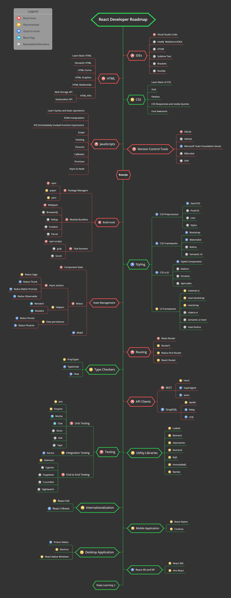
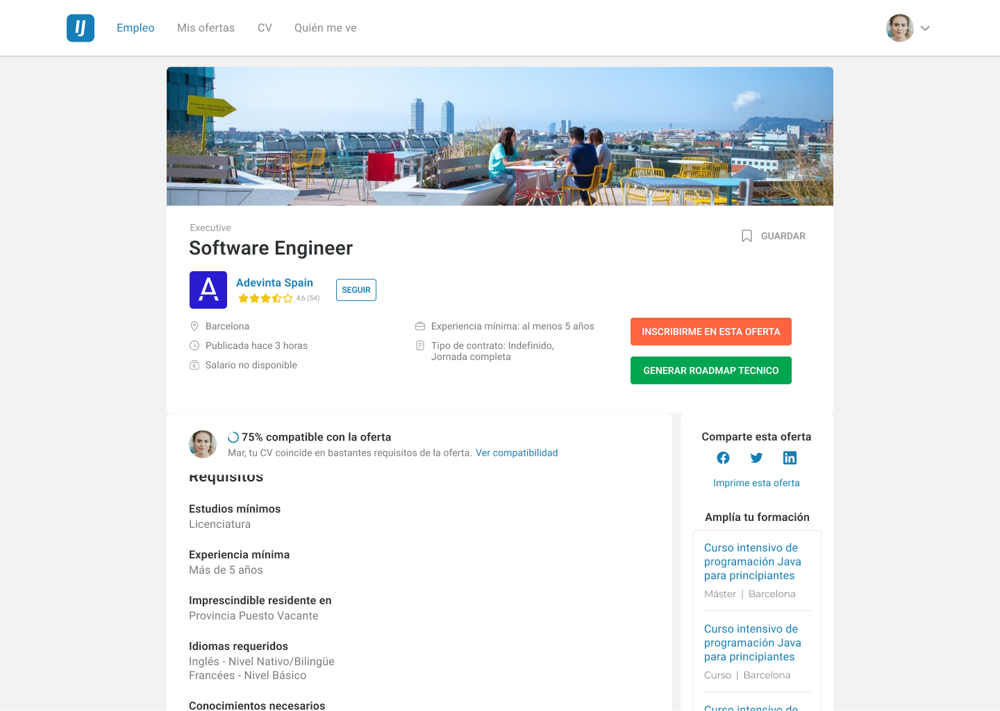
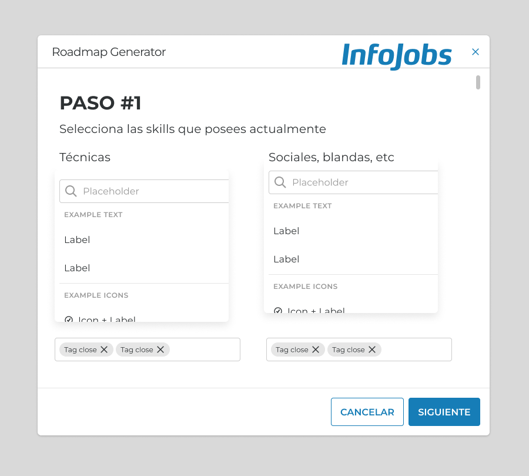
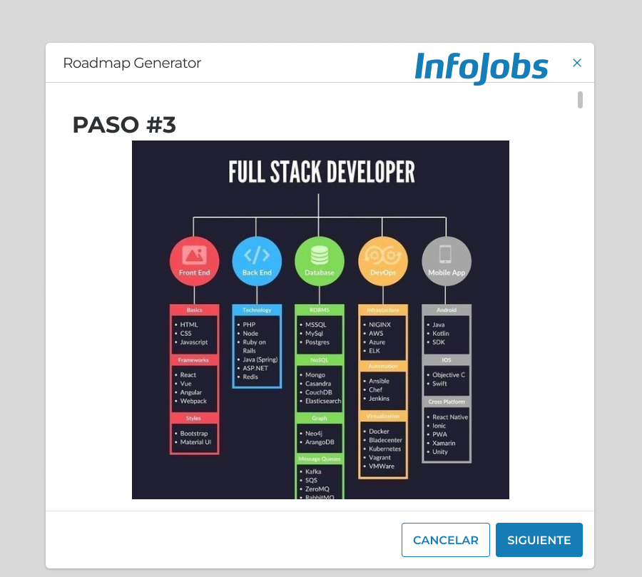

<h1 align="center">
 

  
  

 
Midudev - Infojobs Hackaton
 
</h1>
<h2 align="center">Our idea: Technical developer Roadmap with ChatGPT</h2>

Rodrigo Samayoa (España) y Alejandro Tejada (Guatemala) 

29/05/2023

# About the project and Idea

This hackaton Project is related to Infojobs. The main goal was to create a new feature that can improve Infojobs website. But not only the website, but also the EXPERIENCE. And that's what we wanted to achieve with this hackaton idea.
We came up with a thougth: as a developers, when you are looking for a job, what's the most frustrating for you?

Well, we make a couple of suggestions and we both agreed in one: requirements.

As a developers, we KNOW what we KNOW. Right? but sometimes, we want to know if we need to learn something new in order to reach a new job, or get a promotion. And when we look for jobs, we want to know if we have the necessary skills for the position.

Long story short: Our idea was to develop a tech roadmap for developers.
When you search for any position in Infojobs, you can now check if you have the necessary skills for the job. For now, we are asking CHATGPT what are the necessary skills for the job. But, with more effort, you can make more accurate the decision by retrieving personal information from your github account, your infojobs profile, and more.

Some points on this README:

- Expected Behavior and ideas
- Figma Design for the solution
- Tools and more

# Description of the tools and libraries that we used

- React.js
- Vite (amazing tool btw)
- Tailwind (as a frontend devs, we LOVE Tailwind)
- OpenAI API
- InfoJobs API
- Volta (pretty interesting)
- VS Code
- Vercel
- Warp terminal (pretty good on MAC)
- A lot of Coffe (more Coffe than last time) (**enough coffe for a life**)

# Link to demo

https://youtu.be/2gR4Itw9E14

# Link to Website

https://infojobs-hackathon-totisama.vercel.app

## Project concept

We had a concept of how we wanted to look like. Of course, this image is made on Illustrator, but its a concept that we had.

Extracted from: (https://www.pinterest.com/pin/115475177938783463/)

 
 

# Our Figma Designs

With the contribution of Infojobs we had access to their designs. So, we created these flow

## You navigate to an Infojobs work offer

 

## You click on the _"Generar Roadmap técnico"_ Button. You will see a modal where you can add and select the soft and technical skill you have. Then, you click on the _"Generar"_ button

 

## Enjoy your Roadmap

# Credits and contact

## Our github users

[Alejandro Tejada](https://github.com/tej17584)
[Rodrigo Samayoa](https://github.com/totisama)

### Thanks to:

- Infojobs
- Midudev
- The Community

## Licence

The MIT License (MIT)
